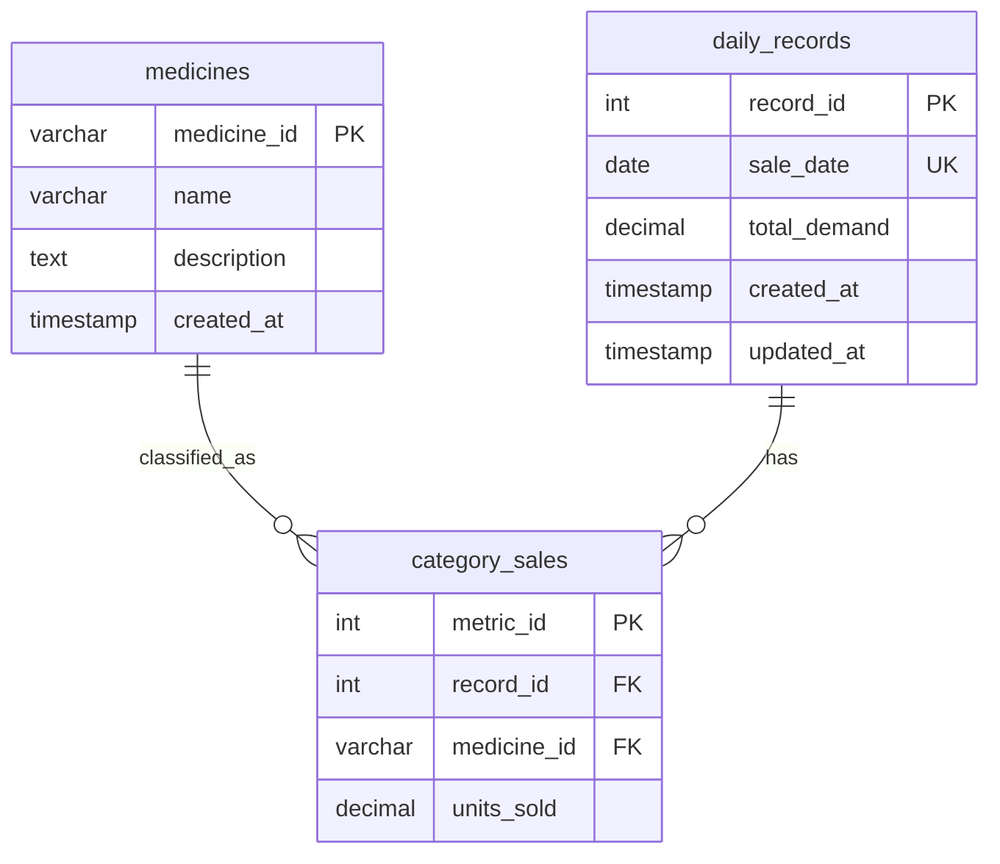

# Entity-Relationship Diagram (Task 2A) — PostgreSQL

## Overview

The relational schema normalizes daily pharmaceutical sales into three tables:
reference data (`medicines`), a daily time-series anchor (`daily_records`), and per-category metrics (`category_sales`).

## Mermaid ERD

## Relationships

| From | To | Cardinality | Description |
|------|----|-------------|-------------|
| `daily_records` | `category_sales` | 1:N | Each day has up to 8 category sales rows |
| `medicines` | `category_sales` | 1:N | Each category sale references one ATC medicine |

## Design Notes

- **`sale_date`** is the natural time-series key used by API date-range endpoints.
- **`total_demand`** is denormalized for fast aggregation queries but can be recomputed from `category_sales`.
- **Cascade delete** on `category_sales` keeps child rows in sync when a daily record is removed.
